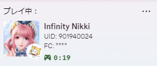
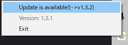

# IfNikkiRPC




# Overview
This program detects the startup of **Infinity Nikki** and displays it in the Discord activity. <br>
Currently supports **Display of Stylist ID (UID) and Friend Code (FC)**. (can also be set to hidden)<br>
The application is stored in the task tray and you can exit the program by pressing the right-click Exit button.<br>
The status of the application is written in a **log file** in the log folder.

# Activity Settings
There is no GUI, so please open the **config.json** included in the folder with an application such as Notepad and edit it directly.

## Lang
Set the language as a **string**. The set language will be reflected in the game title.<br>

### Supported Languages
|   Language   | Value |
|:------------:|:-----:|
|   **日本語**    |  ja   |
| **English**  |  en   |

<INS>If this setting is changed, the application must be restarted.</INS>

## Player
Set the player name as a **string**.<br>
If you use PC, hover the mouse over the **small icon** in the activity to see it.

## UID
Enter the stylist ID (UID) as a **number**. Double quotation marks (`""`) are not required in this field.

## FriendCode
Please enter the friend code as a **string**.
<details>
<summary>Tip</summary>
Infinity Nikki's friend codes are designed to be used by only one person per code.<br>
On the other hand, if one wanted to recruit multiple friends, listing all the letters of all the friend codes would be difficult for others to read (and in some cases could result in a program error due to the character limit).<br>
Therefore, to reduce the number of characters, I propose the following abbreviated notation.

```text
"fsAaBb** AB/Ah/kd/k2"
"fsAaBbC* S/a/3/h/H"
```

This takes advantage of the fact that the **last one or two characters of the string are fixed** when the friend code is issued all at once in a short period of time (verification required).<br>
The “ `*` (`**`) ” part can be replaced by the string of characters separated by a slash on the right.<br>

（This is only my suggestion and does not necessarily mandate this action.）
</details>


## UIDVisible
Set whether to display UID.<br>
Specify with `true` or `false`.<br>
If `true`, the UID is displayed as it is.<br>
If `false`, the UID will be displayed as __****__ on the Discord.

## FCVisible
Set whether to display friend code.<br>
Specify with `true` or `false`.<br>
If `true`, the friend code is displayed as it is.<br>
If `false`, the friend code will be displayed as __****__ on the Discord.

## BtnLabel
Set the **Button Name** of the Discord activity.

## BtnUrl
Set the **Button URL** for the Discord activity.

## Example
```json
{
  "Lang": "en",
  "Player": "Name",
  "UID": 123456789,
  "FriendCode": "fsAaBbCc",
  "UIDVisible": true,
  "FCVisible": false,
  "BtnLabel": "Official Site",
  "BtnUrl": "https://infinitynikki.infoldgames.com/en/home"
}
```

# How to Update
You can check for updates by **right-clicking** on the application in the task tray (v1.4.0 or later).<br>
If an update is available, click on the menu to open the download page in your browser.<br>


# How to Uninstall
Delete the ifnikkiRPC folder.

# Notice
* Do not paste **harmful sites** in the button URL.
* Future version updates of Infinity Nikki <INS>may not work</INS>.

# Reference
- [StarRailDiscordRPC](https://github.com/Gattxxa/StarRailDiscordRPC)
- [Wuthering-Waves-RPC](https://github.com/xAkre/Wuthering-Waves-RPC)
- [Windows のタスクトレイに Python アプリを常駐させ定期的にプログラムを実行する](https://qiita.com/bassan/items/3025eeb6fd2afa03081b)
- [discord-rich-presence](https://pypi.org/project/discord-rich-presence/)
- [PyInstallerで実行ファイルにリソースを埋め込み](https://qiita.com/firedfly/items/f6de5cfb446da4b53eeb)

Thank you!


*Translated by Deepl*